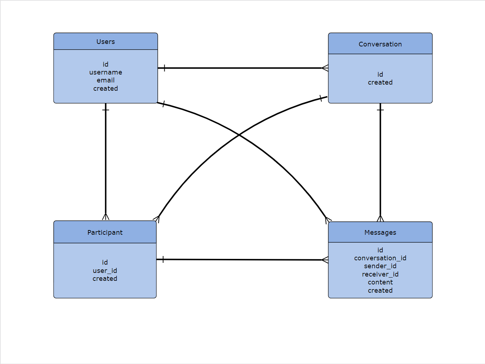

# Design Document

By NUKMAN MUKRAMI ABDULLAH

Video overview: <https://www.youtube.com/watch?v=D0JSubQid2U>

## Scope

Purpose of the Database:

The project called D-message app. The purpose of this project is to serve as the backend(sqlite) and frontend(python) for a messaging application. It will store information about users, conversations, and messages exchanged between users.

Included Entities:
- Users: Information about users including their username, email, and registration date.
- Conversations: Details about conversations between users, such as when they were created.
- Messages: Content of messages exchanged between users, along with timestamps.

Excluded Entities:
- User profile details beyond basic information example profile pictures are outside the scope of this database.

## Functional Requirements

User Capabilities:
    Users should be able to:
    - Register and create an account via query in database(admin authenticate).
    - Send messages to other users.

Beyond Scope:
    Multimedia messaging features example sending images or files.

## Representation

### Entities
1. **Users**
    Attributes:
        - id (Primary Key)
        - username
        - email
        - created(Timestamp)
    Types and Constraints:
        - id: Integer, Auto-increment, Unique
        - username: Text, Unique
        - email: Text, Unique
        - created: Timestamp

2. **Conversations**
    Attributes:
        - id (Primary Key)
        - created (Timestamp)
    Types and Constraints:
        - id: Integer, Auto-increment, Unique
        - created: Timestamp

3. **Participant**
    Attributes:
        - id (Primary Key)
        - user_id (Foreign Key referencing Users)
        - created (Timestamp)
    Types and Constraints:
        - id: Integer, Auto-increment, Unique
        - user_id: Integer, Foreign Key referencing Users
        - created: Timestamp

4. **Messages**
    Attributes:
        - id (Primary Key)
        - conversation_id (Foreign Key referencing Conversations)
        - sender_id (Foreign Key referencing Users)
        - receiver_id (Foreign Key referencing Users)
        - content (Text)
        - created (Timestamp)
    Types and Constraints:
        - id: Integer, Auto-increment, Unique
        - conversation_id: Integer, Foreign Key referencing Conversations
        - sender_id: Integer, Foreign Key referencing Users
        - receiver_id: Integer, Foreign Key referencing Users
        - content: Text
        - created: Timestamp

### Relationships

Please refer to the Entity Relationship Diagram (ERD) below:

1. Users - Conversations (One-to-Many)
2. Conversations - Participant (One-to-Many)
3. Users - Participant (One-to-Many)
4. Conversations - Messages (One-to-Many)
5. Users - Messages (One-to-Many)

## Optimizations

Indexes:
Indexes can be created on frequently queried columns like UserID, ConversationID, and Timestamp in the Messages table to optimize search performance.

Views:
Views can be created to simplify complex queries, such as a view to retrieve all messages in a conversation along with sender and receiver details.

## Limitations

Design Limitations:
The design currently supports one-to-one and one-to-many relationships but does not accommodate many-to-many relationships.

Representation Limitations:
The database may not efficiently handle large volumes of messages or users due to its simplistic design.
Lack of support for multimedia messages may limit the application's functionality compared to more feature-rich messaging platforms.
